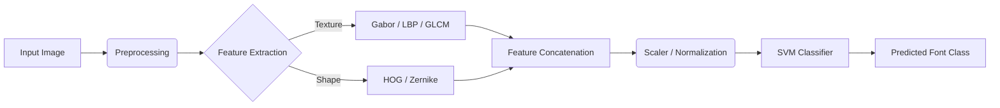

# Arabic Font Recognition System

   

an end-to-end Machine Learning pipeline designed to classify and recognize different Arabic fonts from digital images. Unlike deep learning approaches, this project utilizes a rigorous **Classical Computer Vision** workflow, implementing manual feature extraction techniques (Gabor filters, Zernike moments, HOG) and evaluating multiple statistical classifiers to achieve high accuracy with lower computational overhead.

-----

## 🚀 Key Features

### 🖼️ Advanced Feature Engineering

The system extracts a robust feature vector by combining multiple distinct image descriptors:

  * **Texture Analysis**:
      * **Gabor Filters**: Captures frequency and orientation information to distinguish font strokes.
      * **LBP (Local Binary Patterns)**: Encodes local texture consistency.
      * **GLCM (Gray-Level Co-occurrence Matrix)**: Analyzes statistical texture distribution.
  * **Geometric & Shape Analysis**:
      * **Zernike Moments**: Provides rotation-invariant shape descriptors.
      * **HOG (Histogram of Oriented Gradients)**: Captures edge directions and gradient structures.
      * **Enclosing Area**: Calculates statistical density and aspect ratios.

### 🤖 Model Selection & Evaluation

Extensive experimentation was conducted across multiple classifier families to find the optimal balance of accuracy and inference speed:

  * **Support Vector Machines (SVM)**: (Selected as primary model) Optimized using Grid Search.
  * **Ensemble Methods**: Random Forest classifiers.
  * **Probabilistic Models**: Gaussian Naive Bayes (GNB) and Kernel Density Estimation (KDE).
  * **Discriminant Analysis**: Linear (LDA) and Quadratic (QDA).

### ⚡ Backend Inference Server

  * Includes a Python server script to expose the trained model as an API.
  * Handles image upload, preprocessing, feature extraction, and prediction in real-time.

-----

## 🏗️ Processing Pipeline

The system follows a strict ETL (Extract, Transform, Load) pattern for image data:



-----

## 🛠️ Tech Stack

  * **Language**: Python 3.10
  * **Computer Vision**: OpenCV (`cv2`), Scikit-Image
  * **Machine Learning**: Scikit-Learn
  * **Data Processing**: NumPy, Pandas
  * **Serialization**: Pickle (for model persistence)

-----

## 📂 Project Structure

:small_red_triangle: make sure to create the data directory  and its sub directories like mentioned below 
becauase i depend on this route for loading and saving images after processing 

```
├──  data (will be ignored in git because it is large , but should be local in this directory as it will be used in the project)
|   ├── processed      <- The final, canonical data sets for modeling.
│           ├── font-dataset      <- The final, canonical data sets for modeling.
│                   ├── (IBM Plex Sans Arabic)
│                   ├── (Lemonada)
│                   ├── (Marhey)
│                   ├── (Scheherazade New)      
│   └── raw            <- The original, immutable data dump.
│           ├── font-dataset      <- The original, immutable data dump.
│                   ├── (IBM Plex Sans Arabic)
│                   ├── (Lemonada)
│                   ├── (Marhey)
│                   ├── (Scheherazade New)
├── models             <- Trained and serialized models, model predictions, or model summaries (pickles or  joblib files )
│
├── requirements.txt   <- The requirements file for reproducing the necessary environment (numpy , pandas,  etc,....)
├── src                <- Source code for use in this project.     
│   ├── preprocessing           <- Scripts to download / process / Augment data
│   │   
│   ├── features       <- Scripts to turn raw data into features for modeling
│   │   └── build_features.py
│   │
│   ├── models         <- Scripts to build and  train models and then use trained models to make
│   │   │                 predictions
│   │   ├── predict_model.py
│   │   └── train_model.py
|   |---Scripts         <- contain any other scripts that are used in the project(extract certain features, plot some graph , etc ,.. ) 
│    
```

-----

## 🔧 Installation & Usage

### Prerequisites

  * Python 3.8+
  * `pip` package manager

### 1\. Setup Environment

```bash
# Clone the repository
git clone https://github.com/AbdullahAyman02/Arabic-Font-Recognition.git
cd Arabic-Font-Recognition

# Install dependencies
pip install -r requirements.txt
```

### 2\. Run Prediction Demo

You can test the pipeline using the Jupyter Notebook:

```bash
jupyter notebook Predict.ipynb
```

### 3\. Run Inference Server

To start the backend server for handling external requests:

```bash
cd src/server
python server.py
```

-----

## 🧠 Technical Highlights

  * **Curse of Dimensionality**: Addressed high-dimensional feature vectors by experimenting with **PCA (Principal Component Analysis)** and **LDA** for dimensionality reduction, ensuring the model remains generalizable and fast.
  * **Preprocessing Robustness**: Implemented noise reduction and binarization techniques to ensure the feature extractors work consistently across different image qualities.

-----

## 📜 License

Distributed under the MIT License. See `LICENSE` for more information.
